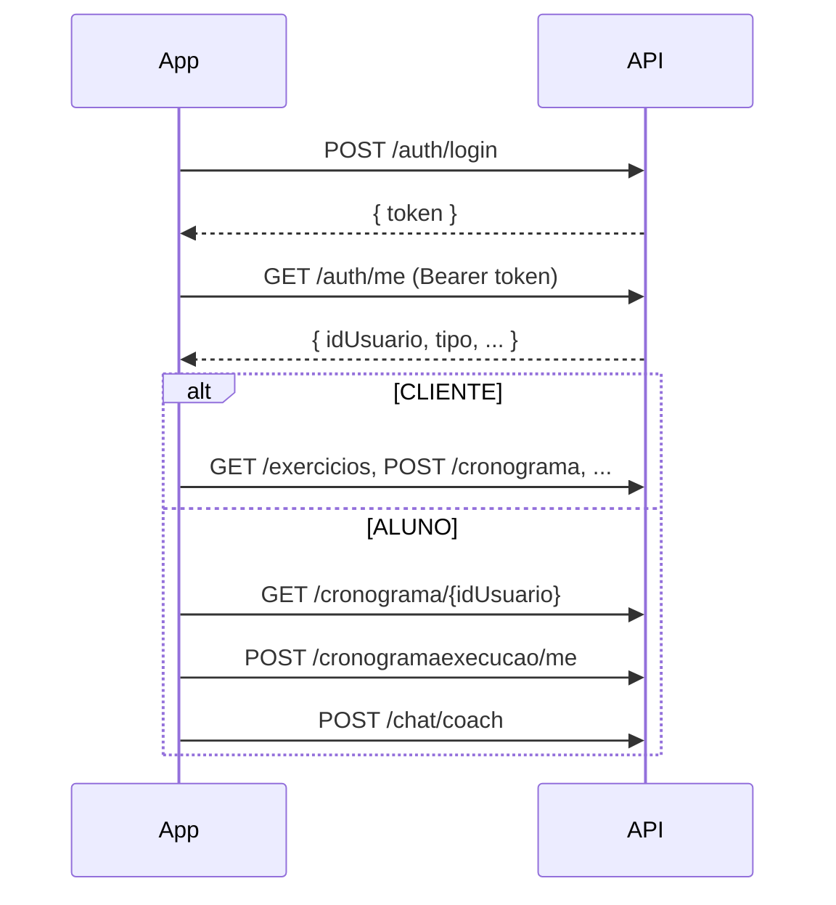

# GymConnect — Documentação da API REST

Referência para integração do frontend (Flutter, web, etc.) com o backend Spring Boot.

---

## URL base

| Ambiente | URL base                                           |
|----------|----------------------------------------------------|
| Desenvolvimento local (Spring Boot) | `http://localhost:8080` |
| Docker Compose (`docker-compose.yml`) | `http://localhost:8080` |

- Todas as rotas abaixo são relativas à URL base (ex.: login = `POST http://localhost:8080/auth/login`).
- **Content-Type** das requisições com corpo: `application/json`.
- **Accept** recomendado: `application/json`.

---

## Autenticação

A API usa **JWT** (stateless). Não há cookie de sessão.

### 1. Obter o token

```http
POST /auth/login
```

**Body (enviar):**

```json
{
  "email": "aluno@email.com",
  "senha": "sua_senha"
}
```

**Resposta 200 (receber):**

```json
{
  "token": "eyJhbGciOiJIUzI1NiIsInR5cCI6IkpXVCJ9..."
}
```

Em caso de credenciais inválidas: **401 Unauthorized**.

### 2. Usar o token nas demais rotas

Inclua o header em **todas** as requisições protegidas:

```http
Authorization: Bearer <token>
```

O filtro remove o prefixo `Bearer ` e valida o JWT. Token inválido ou ausente em rota protegida: **401** ou **403** (conforme regra de perfil).

### 3. Perfis (roles)

| Valor em `tipo` (cadastro) | Authority no token | Uso típico |
|----------------------------|-------------------|---------------------------------------------------------------|
| `CLIENTE`                  | `CLIENTE`         | Personal: cadastra exercícios, cronogramas, lista usuários      |
| `ALUNO`                    | `ALUNO`           | Aluno: executa treino, perfil, registro diário, chat |

Algumas rotas exigem `CLIENTE`; outras aceitam qualquer usuário **autenticado**.

### 4. Usuário logado

```http
GET /auth/me
Authorization: Bearer <token>
```

**Resposta 200:**

```json
{
  "idUsuario": 2,
  "nome": "Alves Aluno",
  "email": "alves@gmail.com",
  "tipo": "ALUNO"
}
```
---

## Enums e tipos comuns

### `TipoUsuario`

`CLIENTE` | `ALUNO`

### `DiaSemana`

`Segunda` | `Terca` | `Quarta` | `Quinta` | `Sexta` | `Sabado` | `Domingo`

### `StatusExecucao`

`FEITO` | `NAO_FEITO`

### `ResponseModel` (mensagens de erro/sucesso)

```json
{
  "mensagem": "Texto descritivo"
}
```

---

## Resumo de rotas

| Método | Rota |                       Auth | Perfil |
|--------|------|----------------------|-----|-----------|
| POST | `/auth/login`                 | Não | — - - - - |
| POST | `/auth/cadastrar`             | Não | — - - - - |
| GET | `/auth/me`                     | Sim | Qualquer |
| GET | `/usuarios`                    | Sim | CLIENTE |
| DELETE | `/usuarios/{idUsuario}`     | Sim | Autenticado* |
| GET | `/exercicios`                  | Sim | CLIENTE |
| POST | `/exercicios`                 | Sim | CLIENTE |
| DELETE | `/exercicios/{idExercicio}` | Sim | CLIENTE |
| POST | `/cronograma`                 | Sim | CLIENTE |
| DELETE | `/cronograma/{idCronograma}`| Sim | CLIENTE |
| GET | `/cronograma/{idAluno}`        | Sim | Qualquer |
| POST | `/cronogramaexercicio`        | Sim | CLIENTE |
| DELETE | `/cronogramaexercicio/{idCronogramaExercicio}` | Sim | CLIENTE |
| GET | `/cronogramaexercicio/aluno/{idAluno}` | Sim | Qualquer |
| POST | `/cronogramaexecucao/me`      | Sim | Qualquer |
| PUT | `/cronogramaexecucao/me/{idExecucao}` | Sim | Qualquer |
| GET | `/cronogramaexecucao/me/cronograma/{idCronograma}` | Sim | Qualquer |
| POST | `/perfil/me`                  | Sim | Qualquer |
| POST | `/registrodiario/me`          | Sim | Qualquer |
| POST | `/chat/coach`                 | Sim | Qualquer |

---

## Autenticação e usuários

### POST `/auth/cadastrar`

Cadastro público (sem token).

**Enviar:**

```json
{
  "nome": "Maria Silva",
  "email": "maria@email.com",
  "senha": "senha123",
  "tipo": "ALUNO"
}
```

| Campo | Tipo | Obrigatório |
|-------|------|-------------|
| nome | string | sim |
| email | string | sim |
| senha | string | sim |
| tipo | `CLIENTE`/ `ALUNO` | sim |

**Receber:**

| Status | Corpo |
|--------|--------|
| 200 | vazio |
| 400 | vazio (e-mail já existe) |

---

### GET `/usuarios`

Lista todos os usuários (**somente CLIENTE**).

**Enviar:** sem body.

**Receber 200:** array de `Usuario` (atenção: pode incluir campo `senha` hash — não exibir na UI).

```json
[
  {
    "idUsuario": 1,
    "uuidUsuario": "a1b2c3d4e5f67890",
    "nome": "Personal",
    "email": "cliente@email.com",
    "senha": "$2a$10$...",
    "tipo": "CLIENTE",
    "cliente": null
  }
]
```

---

### DELETE `/usuarios/{idUsuario}`

Remove usuário por ID.

**Enviar:** sem body. Path: `idUsuario` (number).

**Receber 200:**

```json
{
  "mensagem": "O Usuario foi removido com sucesso!"
}
```

---

## Exercícios

Entidade base cadastrada pelo personal (biblioteca de exercícios).

### GET `/exercicios`

**Perfil:** CLIENTE.

**Receber 200:** array

```json
[
  {
    "idExercicio": 1,
    "nome": "Supino reto",
    "linkYoutube": "https://www.youtube.com/watch?v=..."
  }
]
```

---

### POST `/exercicios`

**Perfil:** CLIENTE.

**Enviar:**

```json
{
  "nome": "Agachamento livre",
  "linkYoutube": "https://www.youtube.com/watch?v=..."
}
```

Não envie `idExercicio` no cadastro (gerado pelo banco).

**Receber:**

| Status | Corpo |
|--------|--------|
| 200 | objeto `Exercicio` salvo (com `idExercicio`) |
| 400 | `{ "mensagem": "O campo nome exercicio precisa ser preenchido!" }` ou link vazio |

---

### DELETE `/exercicios/{idExercicio}`

**Perfil:** CLIENTE.

**Receber 200:**

```json
{
  "mensagem": "Exercicio deletado"
}
```

---

## Cronograma

Plano de treino vinculado a um **aluno**.

### POST `/cronograma`

**Perfil:** CLIENTE.

*.*Enviar:**

```json
{
  "aluno": {
    "idUsuario": 2
  },
  "diasTotais": 30,
  "exercicio": []
}
```

| Campo | Tipo | Obrigatório |
|-------|------|-------------|
| aluno.idUsuario | long | sim |
| diasTotais | int | não |
| exercicio | array | não (pode cadastrar depois via `/cronogramaexercicio`) |

**Receber:**

| Status | Corpo |
|--------|--------|
| 200 | `Cronograma` salvo |
| 404 | `{ "mensagem": "Aluno não cadastrado!" }` |

**Exemplo de resposta 200:**

```json
{
  "idCronograma": 1,
  "aluno": { "idUsuario": 2, "nome": "...", "email": "...", "tipo": "ALUNO", ... },
  "diasTotais": 30,
  "exercicio": []
}
```

---

### GET `/cronograma/{idAluno}`

Lista cronogramas do aluno.

**Enviar:** `idAluno` na URL.

**Receber 200:** array de `Cronograma` (com lista `exercicio` aninhada quando houver).

**Receber 404:** `{ "mensagem": "Cronograma não encontrado!" }` (aluno inexistente).

---

### DELETE `/cronograma/{idCronograma}`

**Perfil:** CLIENTE.

**Receber:**

| Status | Corpo |
|--------|--------|
| 200 | `{ "mensagem": "Cronograma deletado" }` |
| 404 | `{ "mensagem": "Cronograma não encontrado!" }` |

---

## Cronograma × Exercício

Vincula um exercício da biblioteca a um dia/série do cronograma.

### POST `/cronogramaexercicio`

**Perfil:** CLIENTE.

**Enviar:**

```json
{
  "cronograma": {
    "idCronograma": 1
  },
  "exercicio": {
    "idExercicio": 3
  },
  "diaSemana": "Segunda",
  "serie": 4,
  "repeticao": 12,
  "carga": 40
}
```

| Campo | Tipo | Obrigatório |
|-------|------|-------------|
| cronograma.idCronograma | long | sim |
| exercicio.idExercicio | long | sim |
| diaSemana | `DiaSemana` | não |
| serie | int | não |
| repeticao | int | não |
| carga | int | não |

**Receber 200:** objeto `CronogramaExercicio` salvo (campo `cronograma` pode vir omitido por `@JsonBackReference`).

**Receber 400:** `{ "mensagem": "Campo cronograma precisa ser preenchido!" }` ou exercício inválido.

---

### GET `/cronogramaexercicio/aluno/{idAluno}`

Lista todos os vínculos cronograma–exercício dos cronogramas daquele aluno.

**Receber 200:** array (pode ser `[]`).

```json
[
  {
    "idCronogramaExercicio": 1,
    "exercicio": {
      "idExercicio": 3,
      "nome": "Supino",
      "linkYoutube": "https://..."
    },
    "diaSemana": "Segunda",
    "serie": 4,
    "repeticao": 12,
    "carga": 40
  }
]
```

---

### DELETE `/cronogramaexercicio/{idCronogramaExercicio}`

**Perfil:** CLIENTE.

**Receber 200:** `{ "mensagem": "Cronograma deletado" }`  
**Receber 400:** não encontrado.

---

## Execução do cronograma (aluno)

Registro de cada “dia/sessão” de treino do aluno.

### POST `/cronogramaexecucao/me`

Cria execução para o **usuário logado** (token). O aluno do cronograma deve ser o mesmo do token.

**Enviar:**

```json
{
  "cronograma": {
    "idCronograma": 1
  },
  "status": "NAO_FEITO"
}
```

| Campo | Tipo | Obrigatório |
|-------|------|-------------|
| cronograma.idCronograma | long | sim |
| status | `FEITO` \| `NAO_FEITO` | sim |

Não envie `idExecucao` (gerado no servidor).

**Receber 200:**

```json
{
  "idExecucao": 10,
  "cronograma": { "idCronograma": 1, ... },
  "status": "NAO_FEITO",
  "dataExecucao": null
}
```

Quando `status` = `FEITO`, `dataExecucao` é preenchida automaticamente (`YYYY-MM-DD`).

**Erros:** 400 (validação), 403 (cronograma de outro aluno), 404 (cronograma inexistente).

---

### PUT `/cronogramaexecucao/me/{idExecucao}`

Atualiza status de uma execução do usuário logado.

**Enviar:**

```json
{
  "status": "FEITO"
}
```

**Receber 200:** `CronogramaExecucao` atualizado.

**Erros:** 400 (body/status nulo), 403, 404.

---

### GET `/cronogramaexecucao/me/cronograma/{idCronograma}`

Lista execuções de um cronograma, se pertencer ao aluno logado.

**Receber 200:** array de `CronogramaExecucao`.

---

## Perfil do aluno

### POST `/perfil/me`

Cria perfil **uma vez** para o usuário logado.

**Enviar:**

```json
{
  "dataNascimento": "2000-05-15",
  "altura": 1.75,
  "objetivo": "Hipertrofia"
}
```

| Campo | Tipo | Obrigatório (regra de negócio) |
|-------|------|--------------------------------|
| dataNascimento | string (data ISO `YYYY-MM-DD`) | sim |
| altura | number (> 0) | sim |
| objetivo | string (não vazio) | sim |

Não envie `usuario` nem `idPerfil` — o backend associa ao token.

**Receber:**

| Status | Corpo |
|--------|--------|
| 200 | `PerfilModel` salvo |
| 400 | perfil já existe: `"Usuario ja possui perfil cadastrado."` ou validação de campos |

**Exemplo 200:**

```json
{
  "idPerfil": 1,
  "usuario": { "idUsuario": 2, ... },
  "dataNascimento": "2000-05-15",
  "altura": 1.75,
  "objetivo": "Hipertrofia"
}
```

> Não há GET/PUT/DELETE de perfil exposto no controller atual.

---

## Registro diário

Peso/registro ligado a uma execução de treino.

### POST `/registrodiario/me`

**Enviar:**

```json
{
  "execucao": {
    "idExecucao": 10
  },
  "peso": 72.5
}
```

| Campo | Tipo | Obrigatório |
|-------|------|-------------|
| execucao.idExecucao | long | sim |
| peso | number | sim |

A execução deve pertencer ao aluno logado.

**Receber:**

| Status | Corpo |
|--------|--------|
| 200 | `RegistroDiarioModel` salvo |
| 400 | `"id_execucao obrigatorio."` / execução não encontrada / peso nulo |
| 403 | execução de outro usuário |

**Exemplo 200:**

```json
{
  "idRegistro": 1,
  "execucao": { "idExecucao": 10, ... },
  "peso": 72.5
}
```

---

## Chat (coach IA — Gemini)

### POST `/chat/coach`

Envia pergunta; o backend monta contexto do cronograma do aluno (MySQL) e chama o Gemini.

**Enviar:**

```json
{
  "message": "Quantas séries faço no supino na segunda?"
}
```

**Receber 200:**

```json
{
  "reply": "Texto da resposta gerada..."
}
```

**Erros:**

| Status | Situação |
|--------|----------|
| 400 | `message` vazio |
| 401 | sem token / token inválido |
| 502 | falha na API Gemini ou chave não configurada (`GEMINI_API_KEY`) |

Requer variável de ambiente `GEMINI_API_KEY` no servidor.

---

## Fluxo sugerido para o frontend



1. Login → guardar `token`.
2. `GET /auth/me` → saber `tipo` e `idUsuario`.
3. **CLIENTE:** exercícios, cronogramas, vínculos.
4. **ALUNO:** listar cronograma, execuções, registro diário, perfil, chat.

---

## CORS

Origens permitidas pelo backend:

- `http://localhost:5173`
- `http://localhost:3000`
- `http://localhost`

Para Flutter web ou outro host, será necessário incluir a origem em `SecurityConfigurations` / `@CrossOrigin`.

---

## Códigos HTTP usados

| Código | Significado comum nesta API |
|--------|-----------------------------|
| 200 | Sucesso |
| 400 | Validação / regra de negócio |
| 401 | Não autenticado |
| 403 | Sem permissão (ex.: recurso de outro aluno) |
| 404 | Recurso não encontrado |
| 405 | Método HTTP incorreto |
| 502 | Erro ao chamar Gemini (`/chat/coach`) |

---

## Observações para implementação

1. **Senha na listagem de usuários:** `GET /usuarios` pode retornar o hash em `senha` — ignore na interface.
2. **Referências aninhadas:** em POSTs, envie só os IDs necessários dentro de objetos (`aluno`, `cronograma`, `exercicio`, `execucao`).
3. **Datas:** formato ISO `YYYY-MM-DD` para `dataNascimento` e `dataExecucao`.
4. **Chat:** não persiste histórico; cada chamada é independente.
5. **Docker:** API em `8080`; frontend em `http://localhost` (porta 80) usa `VITE_API_URL=http://localhost:8080` no build.

---

*Documentação API GymConnect.*
