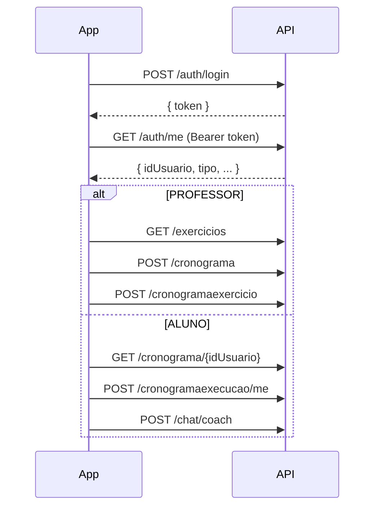

# GymConnect — Documentação da API REST

Referência para integração do frontend (Flutter, web, etc.) com o backend Spring Boot.

---

## URL base

| Ambiente | URL base |
|---|---|
| Desenvolvimento local | `http://localhost:8080` |
| Docker Compose | `http://localhost:8080` |

- Todas as rotas abaixo são relativas à URL base.
- **Content-Type** das requisições com corpo: `application/json`.
- **Accept** recomendado: `application/json`.

---

## Autenticação

A API usa **JWT** (stateless). Não há cookie de sessão.

### 1. Obter o token

```http
POST /auth/login
```

**Body:**

```json
{
  "email": "aluno@email.com",
  "senha": "sua_senha"
}
```

**Resposta 200:**

```json
{
  "token": "eyJhbGciOiJIUzI1NiIsInR5cCI6IkpXVCJ9..."
}
```

Credenciais inválidas: **401 Unauthorized**.

### 2. Usar o token nas demais rotas

```http
Authorization: Bearer <token>
```

Token inválido ou ausente em rota protegida retorna **401** ou **403**.

### 3. Perfis (roles)

| Valor em `tipo` | Papel | Uso típico |
|---|---|---|
| `CLIENTE` | Instrutor | Cadastra exercícios, cronogramas e gerencia alunos |
| `ALUNO` | Aluno | Executa treinos, registra perfil e usa o chat |

> O valor enviado/recebido na API continua sendo `CLIENTE` — "Instrutor" é apenas o rótulo legível.

### 4. Usuário logado

```http
GET /auth/me
Authorization: Bearer <token>
```

**Resposta 200:**

```json
{
  "idUsuario": 2,
  "nome": "Alves Aluno",
  "email": "alves@gmail.com",
  "tipo": "ALUNO"
}
```

---

## Enums e tipos comuns

### `TipoUsuario`

`CLIENTE` (Instrutor) | `ALUNO`

### `DiaSemana`

`Segunda` | `Terca` | `Quarta` | `Quinta` | `Sexta` | `Sabado` | `Domingo`

### `StatusExecucao`

`FEITO` | `NAO FEITO`

### `ApiMessageResponse` (respostas de texto)

```json
{
  "mensagem": "Texto descritivo"
}
```

---

## Resumo de rotas

| Método | Rota | Auth | Perfil |
|---|---|---|---|
| POST | `/auth/login` | Não | — |
| POST | `/auth/cadastrar` | Não | — |
| GET | `/auth/me` | Sim | Qualquer |
| GET | `/usuarios` | Sim | PROFESSOR |
| DELETE | `/usuarios/{idUsuario}` | Sim | PROFESSOR |
| GET | `/exercicios` | Sim | PROFESSOR |
| POST | `/exercicios` | Sim | PROFESSOR |
| PUT | `/exercicios/{idExercicio}` | Sim | PROFESSOR |
| DELETE | `/exercicios/{idExercicio}` | Sim | PROFESSOR |
| POST | `/cronograma` | Sim | PROFESSOR |
| PUT | `/cronograma/{idCronograma}` | Sim | PROFESSOR |
| DELETE | `/cronograma/{idCronograma}` | Sim | PROFESSOR |
| GET | `/cronograma/{idAluno}` | Sim | Qualquer |
| POST | `/cronogramaexercicio` | Sim | PROFESSOR |
| PUT | `/cronogramaexercicio/{idCronogramaExercicio}` | Sim | PROFESSOR |
| DELETE | `/cronogramaexercicio/{idCronogramaExercicio}` | Sim | PROFESSOR |
| GET | `/cronogramaexercicio/aluno/{idAluno}` | Sim | Qualquer |
| POST | `/cronogramaexecucao/me` | Sim | Qualquer |
| PUT | `/cronogramaexecucao/me/{idExecucao}` | Sim | Qualquer |
| GET | `/cronogramaexecucao/me/cronograma/{idCronograma}` | Sim | Qualquer |
| POST | `/perfil/me` | Sim | Qualquer |
| POST | `/registrodiario/me` | Sim | Qualquer |
| POST | `/chat/coach` | Sim | Qualquer |

---

## Autenticação e usuários

### POST `/auth/cadastrar`

Cadastro público (sem token).

**Enviar:**

```json
{
  "nome": "Maria Silva",
  "email": "maria@email.com",
  "senha": "senha123",
  "tipo": "ALUNO"
}
```

| Campo | Tipo | Obrigatório |
|---|---|---|
| nome | string | sim |
| email | string | sim |
| senha | string | sim |
| tipo | `CLIENTE` / `ALUNO` | sim |

**Receber:**

| Status | Corpo |
|---|---|
| 200 | vazio |
| 400 | e-mail já cadastrado |

---

### GET `/usuarios`

Lista todos os alunos e clientes. **Somente PROFESSOR.**

**Receber 200:**

```json
[
  {
    "idUsuario": 2,
    "nome": "Alves Aluno",
    "email": "alves@gmail.com",
    "tipo": "ALUNO"
  }
]
```

> Senha **nunca** é retornada nesta rota.

---

### DELETE `/usuarios/{idUsuario}`

Remove um aluno por ID. **Somente PROFESSOR.**

**Receber:**

| Status | Corpo |
|---|---|
| 200 | `{ "mensagem": "O aluno foi removido com sucesso!" }` |
| 409 | `{ "mensagem": "Não é possível remover este aluno pois ele possui treinos ou registros associados." }` |

---

## Exercícios

Biblioteca de exercícios gerenciada pelo personal.

### GET `/exercicios`

**Perfil:** PROFESSOR.

**Receber 200:**

```json
[
  {
    "idExercicio": 1,
    "nome": "Supino reto",
    "linkYoutube": "https://www.youtube.com/watch?v=...",
    "descricao": "Deite no banco, segure a barra na largura dos ombros..."
  }
]
```

> `descricao` pode ser `null` se não foi preenchida.

---

### POST `/exercicios`

**Perfil:** PROFESSOR.

**Enviar:**

```json
{
  "nome": "Agachamento livre",
  "linkYoutube": "https://www.youtube.com/watch?v=...",
  "descricao": "Posicione os pés na largura dos ombros..."
}
```

| Campo | Tipo | Obrigatório |
|---|---|---|
| nome | string (máx 150) | sim |
| linkYoutube | string (máx 264) | sim |
| descricao | string (máx 2000) | não |

**Receber:**

| Status | Corpo |
|---|---|
| 200 | objeto `Exercicio` salvo (com `idExercicio`) |
| 400 | `{ "mensagem": "O campo nome exercicio precisa ser preenchido!" }` ou link vazio |

---

### PUT `/exercicios/{idExercicio}`

Atualiza nome, link ou descrição de um exercício existente. **Perfil:** PROFESSOR.

**Enviar** (mesmo formato do POST, sem `idExercicio` no body):

```json
{
  "nome": "Agachamento livre",
  "linkYoutube": "https://www.youtube.com/watch?v=...",
  "descricao": "Descrição atualizada."
}
```

**Receber:**

| Status | Corpo |
|---|---|
| 200 | objeto `Exercicio` atualizado |
| 400 | validação (nome/link vazios) |
| 404 | `{ "mensagem": "Exercicio não encontrado" }` |

---

### DELETE `/exercicios/{idExercicio}`

**Perfil:** PROFESSOR.

**Receber:**

| Status | Corpo |
|---|---|
| 200 | `{ "mensagem": "Exercicio deletado" }` |
| 404 | `{ "mensagem": "Exercicio não encontrado" }` |
| 409 | `{ "mensagem": "Nao e possivel excluir: este exercicio esta em uso em um ou mais treinos. Remova-o dos treinos primeiro." }` |

---

## Cronograma

Plano de treino vinculado a um aluno.

### POST `/cronograma`

**Perfil:** PROFESSOR.

**Enviar:**

```json
{
  "aluno": {
    "idUsuario": 2
  },
  "diasTotais": 30,
  "exercicio": []
}
```

| Campo | Tipo | Obrigatório |
|---|---|---|
| aluno.idUsuario | long | sim |
| diasTotais | int | não |
| exercicio | array | não (adicionar depois via `/cronogramaexercicio`) |

**Receber:**

| Status | Corpo |
|---|---|
| 200 | `Cronograma` salvo |
| 404 | `{ "mensagem": "Aluno não cadastrado!" }` |

**Exemplo 200:**

```json
{
  "idCronograma": 1,
  "aluno": { "idUsuario": 2, "nome": "...", "email": "...", "tipo": "ALUNO" },
  "diasTotais": 30,
  "exercicio": []
}
```

---

### PUT `/cronograma/{idCronograma}`

**Perfil:** PROFESSOR.

**Enviar:**

```json
{
  "aluno": {
    "idUsuario": 2
  },
  "diasTotais": 45
}
```

**Receber:**

| Status | Corpo |
|---|---|
| 200 | `Cronograma` atualizado |
| 400 | `{ "mensagem": "Aluno obrigatório." }` |
| 404 | cronograma ou aluno não encontrado |

---

### GET `/cronograma/{idAluno}`

Lista cronogramas do aluno.

**Receber 200:** array de `Cronograma` (com lista `exercicio` aninhada).

**Receber 404:** `{ "mensagem": "Cronograma não encontrado!" }` (aluno inexistente).

---

### DELETE `/cronograma/{idCronograma}`

**Perfil:** PROFESSOR.

**Receber:**

| Status | Corpo |
|---|---|
| 200 | `{ "mensagem": "Cronograma deletado" }` |
| 404 | `{ "mensagem": "Cronograma não encontrado!" }` |

---

## Cronograma × Exercício

Vincula um exercício da biblioteca a um dia/série do cronograma.

### POST `/cronogramaexercicio`

**Perfil:** PROFESSOR.

**Enviar:**

```json
{
  "cronograma": {
    "idCronograma": 1
  },
  "exercicio": {
    "idExercicio": 3
  },
  "diaSemana": "Segunda",
  "serie": 4,
  "repeticao": 12,
  "carga": 40
}
```

| Campo | Tipo | Obrigatório |
|---|---|---|
| cronograma.idCronograma | long | sim |
| exercicio.idExercicio | long | sim |
| diaSemana | `DiaSemana` | não |
| serie | int | não |
| repeticao | int | não |
| carga | int | não |

**Receber 200:** objeto `CronogramaExercicio` salvo.

**Receber 400:** `{ "mensagem": "Campo cronograma precisa ser preenchido!" }` ou exercício inválido.

---

### PUT `/cronogramaexercicio/{idCronogramaExercicio}`

**Perfil:** PROFESSOR. Mesmo formato do POST.

**Receber:**

| Status | Corpo |
|---|---|
| 200 | `CronogramaExercicio` atualizado |
| 400 | validação |
| 404 | vínculo não encontrado |

---

### GET `/cronogramaexercicio/aluno/{idAluno}`

Lista todos os vínculos cronograma–exercício dos cronogramas do aluno.

**Receber 200:**

```json
[
  {
    "idCronogramaExercicio": 1,
    "exercicio": {
      "idExercicio": 3,
      "nome": "Supino",
      "linkYoutube": "https://...",
      "descricao": null
    },
    "diaSemana": "Segunda",
    "serie": 4,
    "repeticao": 12,
    "carga": 40
  }
]
```

---

### DELETE `/cronogramaexercicio/{idCronogramaExercicio}`

**Perfil:** PROFESSOR.

**Receber:**

| Status | Corpo |
|---|---|
| 200 | `{ "mensagem": "Cronograma deletado" }` |
| 404 | vínculo não encontrado |

---

## Execução do cronograma

Registro de cada sessão de treino do aluno.

### POST `/cronogramaexecucao/me`

Cria execução para o **usuário logado** (via token). O aluno do cronograma deve ser o mesmo do token.

**Enviar:**

```json
{
  "cronograma": {
    "idCronograma": 1
  },
  "status": "FEITO"
}
```

| Campo | Tipo | Obrigatório |
|---|---|---|
| cronograma.idCronograma | long | sim |
| status | `FEITO` \| `NAO FEITO` | sim |

**Receber 200:**

```json
{
  "idExecucao": 10,
  "cronograma": { "idCronograma": 1 },
  "status": "FEITO",
  "dataExecucao": "2025-06-14"
}
```

> Quando `status = FEITO`, `dataExecucao` é preenchida automaticamente com a data atual.

**Erros:** 400 (validação), 403 (cronograma de outro aluno), 404 (cronograma inexistente).

---

### PUT `/cronogramaexecucao/me/{idExecucao}`

Atualiza status de uma execução do usuário logado.

**Enviar:**

```json
{
  "status": "FEITO"
}
```

**Receber 200:** `CronogramaExecucao` atualizado.

**Erros:** 400 (status nulo), 403, 404.

---

### GET `/cronogramaexecucao/me/cronograma/{idCronograma}`

Lista execuções de um cronograma pertencente ao aluno logado.

**Receber 200:** array de `CronogramaExecucao`.

---

## Perfil do aluno

### POST `/perfil/me`

Cria ou atualiza o perfil do usuário logado.

**Enviar:**

```json
{
  "dataNascimento": "2000-05-15",
  "altura": 1.75,
  "objetivo": "Hipertrofia"
}
```

| Campo | Tipo | Obrigatório |
|---|---|---|
| dataNascimento | string ISO `YYYY-MM-DD` | sim |
| altura | number (> 0) | sim |
| objetivo | string (máx 50, letras, espaços e vírgulas) | sim |

**Receber:**

| Status | Corpo |
|---|---|
| 200 | `Perfil` salvo |
| 400 | validação de campos |

**Exemplo 200:**

```json
{
  "idPerfil": 1,
  "usuario": { "idUsuario": 2 },
  "dataNascimento": "2000-05-15",
  "altura": 1.75,
  "objetivo": "Hipertrofia"
}
```

---

## Registro diário

Vincula um registro opcional à execução de treino. Campo `peso` é opcional.

### POST `/registrodiario/me`

**Enviar:**

```json
{
  "execucao": {
    "idExecucao": 10
  },
  "peso": 72.5
}
```

| Campo | Tipo | Obrigatório |
|---|---|---|
| execucao.idExecucao | long | sim |
| peso | number (> 0) | não |

A execução deve pertencer ao aluno logado.

**Receber:**

| Status | Corpo |
|---|---|
| 200 | `RegistroDiario` salvo |
| 400 | `"id_execucao obrigatorio."` / peso negativo ou zero |
| 403 | execução de outro usuário |

**Exemplo 200:**

```json
{
  "idRegistro": 1,
  "execucao": { "idExecucao": 10 },
  "peso": 72.5
}
```

---

## Chat (GIA — Gemini)

### POST `/chat/coach`

Envia uma pergunta; o backend monta o contexto do cronograma do aluno (banco de dados) e chama o Gemini para gerar a resposta.

**Enviar:**

```json
{
  "message": "Quantas séries faço no supino na segunda?"
}
```

**Receber 200:**

```json
{
  "reply": "Você realiza 4 séries de 12 repetições no Supino reto..."
}
```

**Erros:**

| Status | Situação |
|---|---|
| 400 | `message` vazio ou nulo |
| 401 | sem token / token inválido |
| 502 | falha na API Gemini (chave não configurada ou erro inesperado): `"Não foi possível conectar à GIA. Tente novamente mais tarde."` |
| 502 | serviço Gemini indisponível (503 upstream): `"A GIA está temporariamente indisponível devido à alta demanda. Por favor, tente novamente em alguns instantes."` |

> Requer a variável de ambiente `GEMINI_API_KEY` no servidor.  
> O backend nunca expõe o JSON bruto de erros da API Gemini ao cliente.  
> O histórico de conversa é mantido localmente no app (não persistido no servidor).

---

## Fluxo sugerido para o frontend



1. Login → guardar `token`.
2. `GET /auth/me` → saber `tipo` e `idUsuario`.
3. **PROFESSOR:** exercícios, cronogramas, vínculos, gestão de alunos.
4. **ALUNO:** listar cronograma, registrar execuções, perfil, chat.

---

## CORS

Origens permitidas pelo backend:

- `http://localhost:5173`
- `http://localhost:3000`
- `http://localhost`

Para Flutter web ou outro host, inclua a origem em `SecurityConfigurations`.

---

## Códigos HTTP usados

| Código | Significado nesta API |
|---|---|
| 200 | Sucesso |
| 400 | Validação / regra de negócio |
| 401 | Não autenticado |
| 403 | Sem permissão (ex.: recurso de outro aluno) |
| 404 | Recurso não encontrado |
| 409 | Conflito (ex.: aluno com treinos, exercício em uso) |
| 502 | Erro ao chamar Gemini (`/chat/coach`) |

---

## Observações para implementação

1. **Referências aninhadas:** em POSTs e PUTs, envie somente os IDs necessários dentro de objetos (`aluno`, `cronograma`, `exercicio`, `execucao`).
2. **Datas:** formato ISO `YYYY-MM-DD` para `dataNascimento` e `dataExecucao`.
3. **Exclusão com dependências:** DELETE de usuário com treinos retorna **409**; DELETE de exercício em uso retorna **409**. Trate esses casos na UI antes de tentar remover.
4. **Chat:** o servidor não persiste histórico — cada chamada a `/chat/coach` é independente. O app mantém o histórico localmente por usuário (SharedPreferences).
5. **Docker:** API em `8080`; para testar no dispositivo físico via USB, execute `adb reverse tcp:8080 tcp:8080` antes de iniciar o app.
